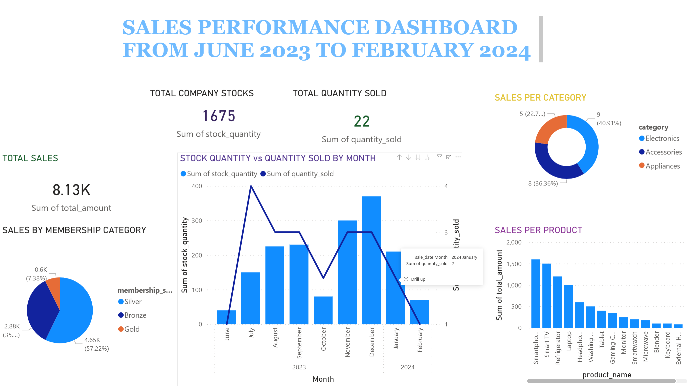

# SQL + Power BI Sales Analytics Dashboard
## Dashboard Preview


# SQL + Power BI Sales Analytics Dashboard

An end-to-end sales analytics project that transforms transactional data into actionable business insights using SQL for data preparation and analysis and Power BI for interactive visualization.

The project demonstrates how structured querying, business metrics, and data visualization can help organizations understand sales performance, monitor trends, and identify opportunities for improvement.


##  Project Objectives

The objectives of this project were to:

* Analyze sales performance using SQL.
* Identify top-performing products and product categories.
* Examine monthly sales trends and revenue patterns.
* Evaluate revenue distribution across product categories.
* Transform analytical results into an interactive Power BI dashboard.
* Present business insights in a format that supports data-driven decision-making.

##  Tools & Technologies

* **SQL:** Data extraction, transformation, aggregation, and analytical querying.
* **Microsoft Power BI:** Dashboard development, data visualization, and business reporting.
* **Power Query:** Data preparation and transformation where applicable.
* **DAX:** Calculated measures and KPIs where implemented.

##  Project Workflow

### 1. Data Preparation and Cleaning

Prepared the sales data for analysis by reviewing its structure, checking data quality, and applying the necessary transformations.

### 2. SQL Analysis

Used SQL queries to explore the dataset and derive insights from transactional sales records.

The analysis focused on:

* Sales and revenue aggregation.
* Product performance comparisons.
* Monthly sales trends.
* Revenue distribution across product categories.

### 3. Data Visualization

Imported the prepared data into Power BI and developed a dashboard to communicate the findings visually.

The dashboard organizes key metrics and sales trends to make the results easier to interpret.

### 4. Business Insights

Interpreted the analytical results to identify high-performing products, changing sales patterns, and differences in revenue contribution across categories.

##  Key Business Questions

The analysis explores the following questions:

1. Which products generate the highest sales?
2. How does sales performance change from month to month?
3. Which product categories contribute the most revenue?
4. How is revenue distributed across the available categories?
5. Which sales trends or product performance patterns deserve further investigation?

##  Key Insights

The analysis highlights the following findings:

* **Product performance:** Identifies the products contributing the most to sales.
* **Sales trends:** Examines monthly performance to reveal changes over time.
* **Category contribution:** Compares revenue across product categories.
* **Performance monitoring:** Presents analytical results in a dashboard that supports easier comparison and reporting.

These findings can help inform product prioritization, sales monitoring, and business planning.

##  Repository Structure

```text
sql-powerbi-sales-analytics/
│
├── sql/
│   └── queries.sql
│
├── powerbi/
│   └── COMPANY SALES DASHBOARD.pbix
│  
│
└── README.md
```

##  How to Explore the Project

1. Clone or download this repository.
2. Open `sql/queries.sql` to review the analytical queries.
3. Connect the SQL queries to the relevant dataset or database if required.
4. Open `powerbi/sales_dashboard.pbix` in Microsoft Power BI Desktop.
5. Refresh the data connections if prompted and review the dashboard.

**Note:** The original dataset and any required database configuration must be available for the SQL queries and Power BI report to run successfully.

##  Skills Demonstrated

* SQL querying and data aggregation
* Data preparation and transformation
* Exploratory data analysis
* Sales and product performance analysis
* Business intelligence reporting
* Power BI dashboard development
* Data visualization and analytical storytelling
* Translating business questions into analytical outputs

##  Author

**Stacy Moraa**
Data Analyst interested in transforming data into meaningful insights that support business performance and informed decision-making.
